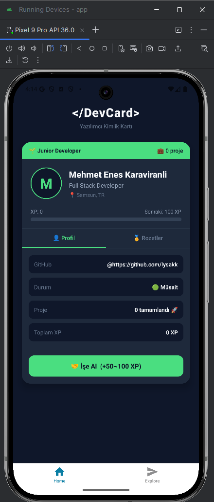

# 🪪 DevCard — Yazılımcı Kimlik Kartı

> React Native ile geliştirilmiş, oyunlaştırma mekanikleri içeren interaktif geliştirici profil kartı.

[](https://reactnative.dev/)
[](https://expo.dev/)
[](LICENSE)

---

## 📱 Uygulama Hakkında

**DevCard**, yazılımcıların dijital kimlik kartını oyunlaştırma mekanikleriyle birleştiren bir React Native uygulamasıdır. İşe alınarak XP kazanırsın, seviye atlarsın ve rozetler kazanırsın!

### 🎮 Oyunlaştırma Özellikleri

| Özellik | Detay |
|---|---|
| **XP Sistemi** | Her "İşe Al"da 50–100 XP kazan |
| **4 Seviye** | 🌱 Junior → ⚡ Mid → 🔥 Senior → 👑 Principal |
| **Rozetler** | İlk İş, Popüler Dev, Senior, Principal |
| **Dinamik UI** | Seviyeye göre renk ve emoji değişimi |
| **İlerleme Çubuğu** | Anlık XP ve sonraki seviye görünümü |

---

## 🚀 Nasıl Çalıştırılır?

### Gereksinimler
- Node.js 18+
- Expo CLI
- Expo Go uygulaması (iOS/Android)

### Kurulum

```bash
# 1. Repoyu klonla
git clone https://github.com/lysakk/devcard.git
cd devcard

# 2. Bağımlılıkları yükle
npm install

# 3. Expo'yu başlat
npx expo start
```

### Çalıştırma
```bash
# Expo Go ile (Telefon)
# Terminal'deki QR kodu Expo Go uygulamasıyla tara

# Android emülatör
npx expo start --android

# iOS simülatör
npx expo start --ios
```

---

## 📦 APK İndir

> [⬇️ DevCard v1.0 APK İndir](https://github.com/lysakk/devcard/releases/tag/v1.0)

---

## 🏗️ Proje Yapısı

```
devcard/
├── app/
│   └── (tabs)/
│       └── index.tsx    # Ana uygulama
├── app.json
├── package.json
└── README.md
```

## 🧩 Kullanılan Teknolojiler

- **React Native** — Mobil uygulama çatısı
- **Expo** — Geliştirme ve build ortamı
- **Animated API** — Pulse animasyonu
- **React Hooks** — useState, useRef

---

## 📸 Ekran Görüntüleri



---

## 👤 Geliştirici

**Mehmet Enes Karaviranli** — [@lysakk](https://github.com/lysakk)

---

## 📄 Lisans

MIT © 2025
